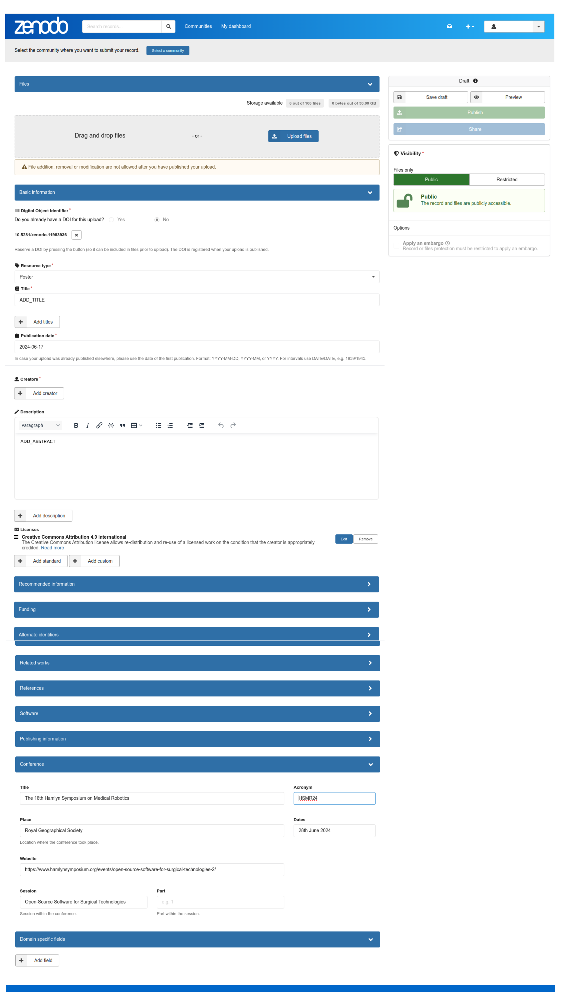

# Poster

## Abstract templates
* See word and latex templates [here](templates)
* You can also make use of our overleaf templates which anyone with this [link](https://www.overleaf.com/read/tdshfrwxmggz#33669e) can view this project

## Poster presentation details
### Zenodo DOI's for accepted poster and two-page abstracts
For authors who wish to make their work publicly available, we kindly ask that you upload your posters to Zenodo. This will provide a formal citation option for your work, such as a DOI.

See below steps and a figure. 
1. Create an new zenodo submission https://zenodo.org/uploads/new 
2. Drag and drop your PDF poster 
3. Do you already have a DOI for this upload? Yes! Please add it or select `NO` that automatically create a DOI for your poster.
4. Select resource type: “Poster”, TITLE, creators (names, ORCID, Affilication, Role), Description(abstract of your poster) 
5. Select Licence for our poster  
6. Add detials of the conference  
    **Title**: The 17th Hamlyn Symposium on Medical Robotics  
    **Acronym**: HSMR25  
    **Place**:  Royal Geographical Society  
    **Dates**: 27th June 2025
    **Website**: https://www.hamlynsymposium.org/events/healing-through-collaboration-open-source-software-in-surgical-biomedical-and-ai-technologies/   
    **Session**: Healing Through Collaboration: Open-Source Software in Surgical, Biomedical and AI Technologies
7. Please feel free any of the additional informaion to your poster: “recommended information”, “funding”, “alternative identifiers”, “related work”, “references”, “publishing infomraiton” and “domain specific fields”.
8. Please share your doi submission in the email thred.
9. Many thanks for your submission, please do not hesiate to reach out Saransh at s.chopra@ucl.ac.uk and Miguel m.xochicale@ucl.ac.uk if there is anythig we can help! 

 
### Poster Size and Allocation
We have an allocation of 8 poster boards located in the Marquee. Each board is double sided allowing for a max of 16 A0 portrait size posters. In terms of the physical poster, the poster dimensions must comply with the A0 PORTRAIT standard: Maximum height: 118.9 cm (46.8 inches) Maximum width:  84.1 cm (33.1 inches). You can also use A1 or A2 size if that is more portable size for you. The poster should NOT be laminated. Mounting materials will be provided at the poster board onsite. 

All poster boards will be labelled with your workshop name and a poster number. 
If you are presenter, please make reach go the registration desk at 08:30 and one of our volunteers will direct them to the correct boards to set up their poster. 

### Poster Spotlights 
We have Spotlight sessions for posters at 12:20, so please prepare a one-minute presentation of your poster in any format that suits you. This could be simply projecting your poster, using slides with videos or demos, or even bringing portable hardware if possible. Please remember that, due to a tight schedule, presentations must be strictly limited to one minute. You’ll have further time during lunch or at the poster marquee to discuss your work in more detail.

### Program Chairs and Contact
* [Saransh Chopra](https://saransh-cpp.github.io/), University College London
* Dr [Miguel Xochicale](https://mxochicale.github.io/), University College London

Please do not hesiate to reach out Saransh at s.chopra@ucl.ac.uk and Miguel m.xochicale@ucl.ac.uk if there is anythig we can help! 
